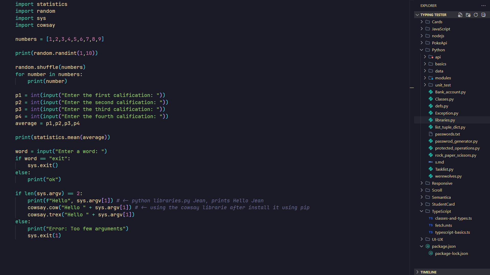
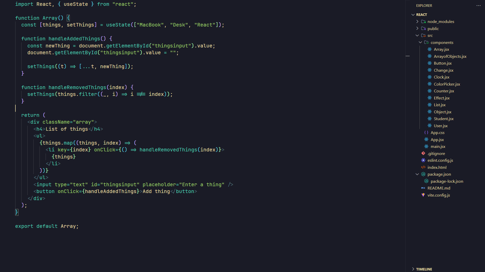
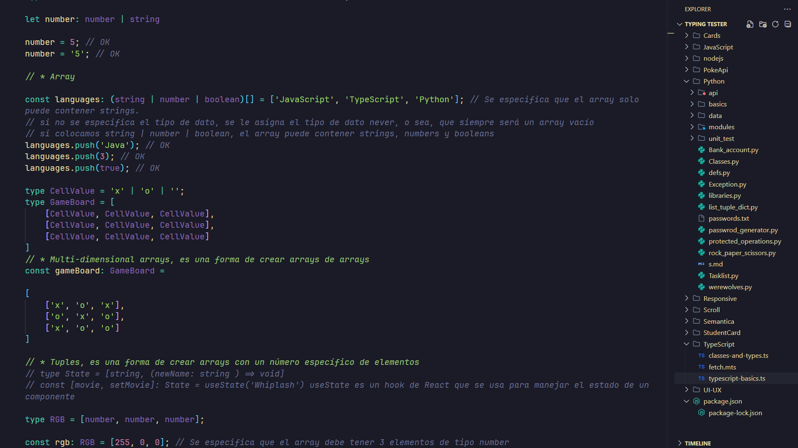

# Soft Midnight

A calming and elegant dark theme for Visual Studio Code, designed to reduce eye strain while maintaining high contrast for readability.





---

## Features

- **Soft, high-contrast colors**: A harmonious blend of deep blues, soft beiges, and vibrant accents.
- **Eye-friendly design**: Perfect for long coding sessions.
- **Comprehensive syntax highlighting**: Supports a wide range of programming languages.
- **Custom UI theming**: Consistent and elegant styling for the entire editor.

---

## Installation

1. Open **Visual Studio Code**.
2. Go to the Extensions view by clicking on the Extensions icon in the Activity Bar on the side of the window or by pressing `Ctrl+Shift+X`.
3. Search for **"Soft Midnight"**.
4. Click **Install** to add the theme to Visual Studio Code.
5. Open the Command Palette (`Ctrl+Shift+P`) and type **"Preferences: Color Theme"**.
6. Select **"Soft Midnight"** from the list.

---

## Recommended Settings

For the best experience, consider adding these settings to your `settings.json` file:

```json
{
  "workbench.colorTheme": "Soft Midnight",
  "editor.fontSize": 14,
  "editor.fontFamily": "'Fira Code', 'Consolas', 'Courier New', monospace",
  "editor.lineHeight": 24,
  "editor.cursorStyle": "line",
  "editor.cursorBlinking": "smooth"
}

